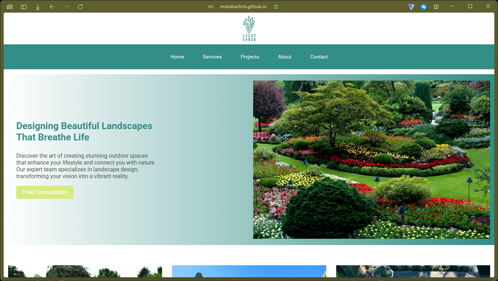

# Lucky Shrub — Homepage Design

Final project for the HTML and CSS in Depth course, part of the Meta Front-End Developer Certificate on Coursera.

Live site: [molokochris.github.io/lucky-shrub-landscaping](https://molokochris.github.io/lucky-shrub-landscaping/)



---

## About

Lucky Shrub is a fictional landscaping brand used as a running example throughout the Meta curriculum. The brief for this project was to build out their homepage — nav, hero, projects section, and footer — using only HTML and CSS.

This is a homepage design only. The nav links don't go anywhere; that's by design, not an oversight. I'm sharing it publicly as a reference for other learners going through the same course.

---

## Built with

- HTML5
- CSS3 (Flexbox, Grid, media queries)

No frameworks, no libraries.

---

## What I practised

- Semantic HTML structure
- CSS Flexbox and Grid for layout
- Responsive design with media queries
- CSS combinators and pseudo-classes
- Visual hierarchy and spacing
- Working with images and assets

---

## Running it locally

```bash
git clone https://github.com/molokochris/lucky-shrub-landscaping.git
cd lucky-shrub-landscaping
```

Open `index.html` in your browser. That's it.

---

## For other learners

If you're currently working through this project, use this as a reference point — not a copy. The brief leaves a lot of room to make it your own, and the best way to learn is to actually wrestle with the CSS yourself.

---

## Licence

MIT — do whatever you want with it.

---

*Moloko Chris Poopedi — Limpopo/Pretoria, South Africa*
